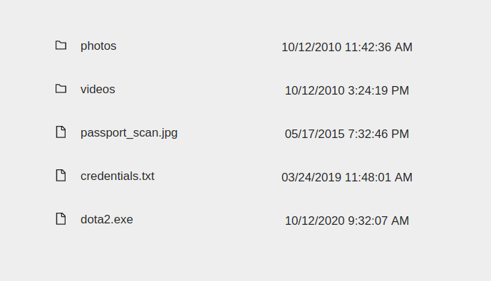

Available Scripts

In the project directory, you can run:

## Install dependencies
### `npm install`

## Start json server
### `json-server --watch ./server/data.json --port 5000`

## Start project
### `npm start`

After start open [http://localhost:3000](http://localhost:3000) to view it in the browser.

​
